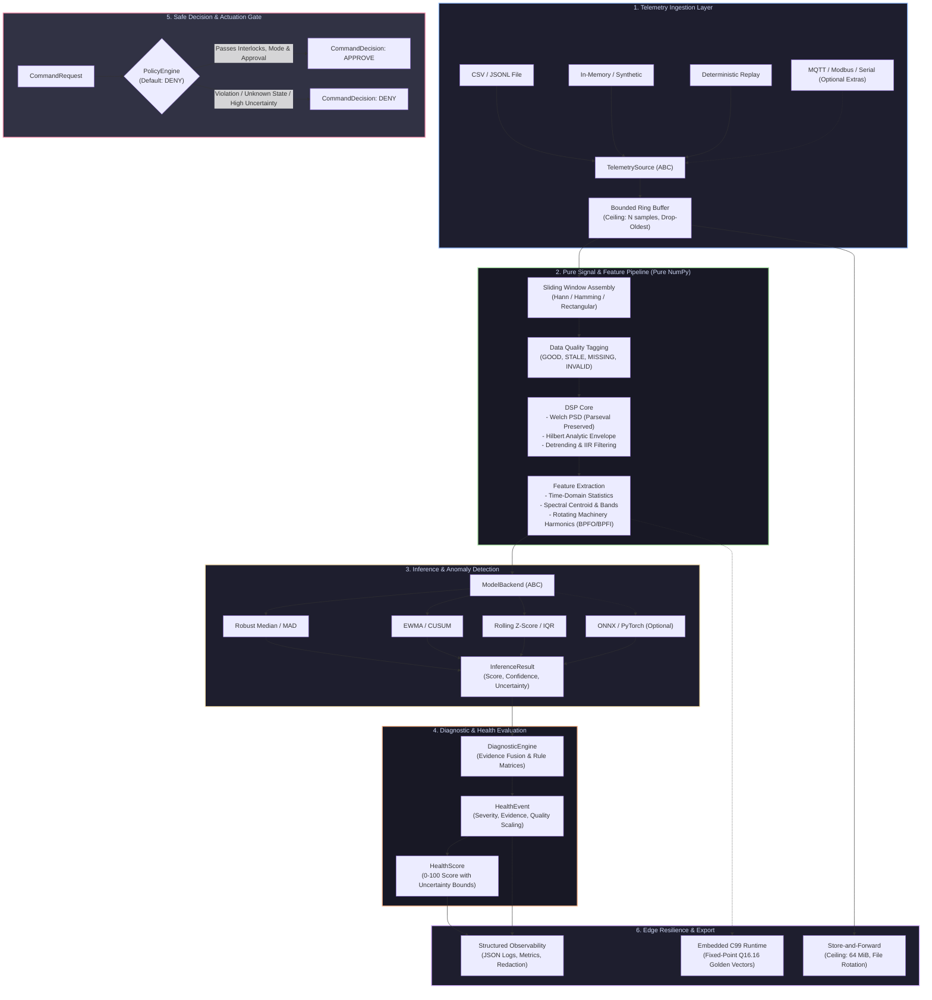

<div align="center">

# SOFIA ENGINE

### Offline-First Edge Intelligence for Industrial Telemetry, Condition Monitoring & Safe Technical Automation

[](LICENSE)
[](pyproject.toml)
[](pyproject.toml)
[](pyproject.toml)
[](embedded/)
[](specs/001-sofia-engine-modernization/threat-model.md)
[](https://rootcastle.com/)

[**Documentation**](https://rootcastleco.github.io/sofia-rl/) | [**Specifications**](specs/001-sofia-engine-modernization/) | [**Threat Model**](specs/001-sofia-engine-modernization/threat-model.md) | [**Embedded Reference**](embedded/) | [**Rootcastle**](https://rootcastle.com/)

---

</div>

## Executive Overview

**Sofia Engine** is an engineering-grade, offline-first edge intelligence runtime built from the ground up by **[Rootcastle Engineering & Innovation](https://rootcastle.com/)**. Designed for mission-critical industrial environments—including rotating machinery diagnostics, power generation, IIoT telemetry ingestion, and safe technical automation—Sofia converts raw sensor streams into structured, mathematically validated engineering evidence directly at the edge.

Unlike generic machine learning frameworks that introduce volatile dependencies, unbounded resource consumption, and cloud-reliant architectures, Sofia Engine operates with **NumPy as its sole runtime dependency**. It pairs pure digital signal processing (DSP) and statistical anomaly detection with a deterministic safety gate whose default posture is **DENY**.

> **Heritage & Continuity:** Sofia Engine v2.0 is a complete, engineering-grade modernization of the original `sofia-rl` codebase. It retains the Apache-2.0 license, preserves first-major-version API compatibility via [`sofia_ai.compat`](src/sofia_ai/compat.py), and preserves the unmodified legacy implementation under [`legacy/sofia_ai_v1/`](legacy/sofia_ai_v1/).

---

## The Rootcastle Engineering Pillars

Industrial operational technology (OT) cannot tolerate stochastic unpredictability, unconstrained memory allocations, or black-box hallucination. Sofia Engine is governed by five foundational non-negotiables:

```
+---------------------------------------------------------------------------------------+
|                                ROOTCASTLE PILLARS                                     |
+---------------------------------------------------------------------------------------+
|  1. EVIDENCE BEATS HYPE        Every metric derives from verifiable physical/spectral |
|                                evidence. No unbacked accuracy claims.                 |
|  2. DEFAULT "DENY" SAFETY      Zero control path bypass. All control decisions pass   |
|                                through physical interlocks and operator gates.        |
|  3. BOUNDED RESOURCE ENVELOPE  Strict ceilings on buffers, queues, windows, and disk. |
|                                Zero unbounded memory allocations.                     |
|  4. STRICT DETERMINISM         Pure functions, injected RNGs, and explicit clocks.    |
|                                Same telemetry + same config = byte-identical output.  |
|  5. AIR-GAPPED BY DESIGN       Zero network or broker dependency in the core. Runs on |
|                                bare metal, isolated gateways, and microcontrollers.   |
+---------------------------------------------------------------------------------------+
```

1. **Evidence Beats Hype**: We publish no performance or diagnostic accuracy figures that cannot be reproduced deterministically from this repository. Sofia does not hallucinate machine states; every diagnostic event is tied to an audit trail of quantifiable signal features.
2. **Default "DENY" Safety**: Actuation is never a side-effect of inference. The `PolicyEngine` mandates operator approval, operational state verification, rate limiting, and physical interlock clearance before any command is authorized.
3. **Bounded Resource Envelopes**: Ingest buffers (`drop-oldest`), store-and-forward persistence, and feature arrays enforce finite static limits. Memory leaks and memory exhaustion crashes are architecturally prevented.
4. **Strict Determinism**: Library code never seeds global PRNGs or queries uncoordinated system clocks. Clocks (`TimeSource`) and random generators (`numpy.random.Generator`) are explicitly injected.
5. **Zero-Bloat Core**: Core telemetry ingestion, DSP, feature extraction, statistical inference, diagnostics, and policy gating execute with zero dependencies beyond NumPy. Cloud clients (MQTT), field protocols (Modbus, Serial), and deep learning runtimes (ONNX Runtime, PyTorch) reside strictly in optional extras.

---

## System Architecture

Sofia Engine is organized into strictly bounded, unidirectional layers. High-level orchestrations cannot leak into pure computational cores, and actuation surfaces remain physically isolated from diagnostic assistants.



---

## Mathematical & Scientific Foundations

Sofia Engine formulates industrial condition monitoring through analytical signal processing and robust statistics rather than opaque heuristics.

### 1. Time-Domain Statistical Indicators

Given a discrete time-series window $\mathbf{x} = [x_0, x_1, \dots, x_{N-1}] \in \mathbb{R}^N$:

* **Root Mean Square (RMS)** (ISO 10816/20816 vibration severity):
  $$\text{RMS}(\mathbf{x}) = \sqrt{\frac{1}{N}\sum_{n=0}^{N-1} x_n^2}$$

* **Crest Factor ($CF$)** (impulsive shock detection in rolling-element bearings):
  $$CF = \frac{\max_{n} |x_n|}{\text{RMS}(\mathbf{x})}$$

* **Sample Kurtosis ($\text{Kurt}$)** (fourth standardized moment for early bearing spalling):
  $$\text{Kurt}(\mathbf{x}) = \frac{\frac{1}{N}\sum_{n=0}^{N-1}(x_n - \bar{x})^4}{\left(\frac{1}{N}\sum_{n=0}^{N-1}(x_n - \bar{x})^2\right)^2}$$

* **Shape Factor ($SF$) & Margin Factor ($MF$)**:
  $$SF = \frac{\text{RMS}(\mathbf{x})}{\frac{1}{N}\sum_{n=0}^{N-1}|x_n|}, \quad MF = \frac{\max_{n}|x_n|}{\left(\frac{1}{N}\sum_{n=0}^{N-1}\sqrt{|x_n|}\right)^2}$$

### 2. Spectral Estimation & Energy Conservation

Spectral features are derived using Welch’s averaged modified periodogram method with discrete Fourier transform (DFT) windowing. Energy conservation between time and frequency domains is strictly enforced via **Parseval's Theorem**:

$$\sum_{n=0}^{N-1} |x_n|^2 = \frac{1}{N} \sum_{k=0}^{N-1} |X_k|^2$$

Where $X_k = \sum_{n=0}^{N-1} x_n w_n e^{-j 2\pi k n / N}$ and $w_n$ is a coherent-gain corrected Hann or Hamming window.

* **Spectral Centroid ($f_c$)**:
  $$f_c = \frac{\sum_{k=0}^{M-1} f_k \cdot P(f_k)}{\sum_{k=0}^{M-1} P(f_k)}$$
  where $P(f_k)$ denotes the one-sided Power Spectral Density (PSD) at bin frequency $f_k$.

* **Spectral Flatness (Wiener Entropy)**:
  $$\gamma_\infty = \frac{\exp\left(\frac{1}{M}\sum_{k=0}^{M-1} \ln P(f_k)\right)}{\frac{1}{M}\sum_{k=0}^{M-1} P(f_k)}$$
  Distinguishes tonal resonance ($\gamma_\infty \to 0$) from broadband white noise ($\gamma_\infty \to 1$).

### 3. Envelope Analysis via the Hilbert Transform

For detecting impact transients in defective rolling-element bearings obscured by low-frequency machine vibration, Sofia constructs the analytic signal:

$$\tilde{x}(t) = x(t) + j \cdot \mathcal{H}\{x(t)\} = A(t)e^{j\phi(t)}$$

Where the Hilbert transform $\mathcal{H}\{x(t)\}$ is evaluated via the Cauchy principal value:

$$\mathcal{H}\{x(t)\} = \frac{1}{\pi} \text{p.v.} \int_{-\infty}^{\infty} \frac{x(\tau)}{t - \tau} \, d\tau$$

The demodulated instantaneous envelope $A(t) = \sqrt{x(t)^2 + [\mathcal{H}\{x(t)\}]^2}$ isolates fundamental bearing fault frequencies:
* **Ball Pass Frequency Outer (BPFO)**
* **Ball Pass Frequency Inner (BPFI)**
* **Ball Spin Frequency (BSF)**
* **Fundamental Train Frequency (FTF)**

### 4. Robust Anomaly Estimation (Median Absolute Deviation)

Traditional Gaussian estimators ($\mu \pm 3\sigma$) break down when training windows contain fault transients. Sofia defaults to the non-parametric **Median Absolute Deviation (MAD)**:

$$\text{MAD} = \text{median}\left(\left|x_i - \text{median}(\mathbf{x})\right|\right)$$

The modified $z$-score is computed as:

$$M_i = \frac{0.6745 \cdot (x_i - \text{median}(\mathbf{x}))}{\text{MAD}}$$

The factor $0.6745$ ensures asymptotic consistency with the standard deviation for normally distributed observations while maintaining an breakdown point of $50\%$.

### 5. Composite Health Scoring with Uncertainty Bounds

The holistic machine health metric $H \in [0, 100]$ fuses diagnostic event severities with data quality weights $Q \in [0, 1]$:

$$H = 100 - \min\left(100, \sum_{i=1}^{K} w_i \cdot \mathcal{S}_i \cdot Q_i\right)$$

Where $\mathcal{S}_i \in \{0, 25, 50, 75, 100\}$ corresponds to severity levels (`NORMAL`, `LOW`, `MEDIUM`, `HIGH`, `CRITICAL`), and $w_i$ represents diagnostic rule confidence. The uncertainty interval $[H_{lower}, H_{upper}]$ expands proportionally when data quality degrades (`MISSING`, `STALE`, `OUT_OF_RANGE`), ensuring operators are never presented with falsely confident assessments.

---

## Installation

Sofia Engine requires **Python 3.11+**.

```bash
# Minimal production installation (Numerical DSP & Core only - NumPy runtime dependency)
pip install sofia-engine

# With industrial telemetry adapters (MQTT, Modbus TCP/RTU, Serial)
pip install "sofia-engine[industrial]"

# With edge deep learning inference backends (ONNX Runtime, PyTorch)
pip install "sofia-engine[onnx,torch]"

# Full development & test suite
pip install "sofia-engine[dev]"
```

### Installation Matrix

| Extra | Included Packages | Primary Use Case |
|---|---|---|
| *(none)* | `numpy>=1.24` | Minimal air-gapped edge gateways, embedded Linux, containers |
| `industrial` | `paho-mqtt`, `pymodbus`, `pyserial` | Industrial field connectivity (PLC, SCADA, RS-485, Broker) |
| `onnx` | `onnxruntime>=1.15` | Accelerated edge inference on Quantized ONNX models |
| `torch` | `torch>=2.0` | Deep neural feature extractors & offline RL simulation |
| `api` | `fastapi`, `uvicorn` | REST/SSE telemetry endpoints and web gateways |
| `dev` | `pytest`, `hypothesis`, `ruff`, `mypy`, `pip-audit` | Complete verification, linting, and property testing |
| `docs` | `mkdocs`, `mkdocs-get-deps` | Offline documentation build |

---

## Quickstart

### 1. Ingest, Window & Extract Vibration Features

Process high-frequency vibration data using pure DSP routines:

```python
from pathlib import Path
import numpy as np
from sofia_ai.telemetry import CsvSource
from sofia_ai.signal import windows_from_samples, welch_psd
from sofia_ai.features import extract_from_array

# 1. Ingest bounded batch from telemetry source
source = CsvSource("examples/data/vibration.csv", device_id="pump-01", unit="g")
with source:
    samples = source.read(max_records=2048)

# 2. Assemble sliding windows (length=512, hop=256 at fs=1000 Hz)
windows = windows_from_samples(samples, length=512, hop=256, sample_rate=1000.0)

# 3. Extract comprehensive physical features
features = extract_from_array(windows[0].values, sample_rate=windows[0].sample_rate, shaft_hz=25.0)
print(f"Features extracted: {features.size}")
print(f"RMS: {features['rms']:.3f} g | Crest Factor: {features['crest_factor']:.2f}")

# 4. Compute Welch Power Spectral Density with Parseval conservation
psd = welch_psd(windows[0].values, sample_rate=1000.0)
dominant_freq = psd.frequencies[np.argmax(psd.values)]
print(f"Dominant frequency: {dominant_freq:.2f} Hz (Resolution: {psd.df:.2f} Hz)")
```

### 2. End-to-End Machine Health & Anomaly Scoring

Execute a resilient diagnostic pipeline with data quality awareness:

```python
from sofia_ai.core.contracts import DataQuality
from sofia_ai.inference import create_backend, build_manifest_for
from sofia_ai.inference.detectors import DetectorConfig
from sofia_ai.diagnostics import DiagnosticEngine, RuleContext, compute_health_score

# 1. Initialize robust MAD anomaly detector
detector = create_backend("mad")
detector.config = DetectorConfig(feature="rms", window_size=32, threshold=3.0)
detector.load(build_manifest_for(detector, model_id="bearing-baseline"))

# 2. Evaluate feature vector through inference backend
result = detector.infer(features)
print(f"Anomaly detected: {result.outcome} (Score: {result.score:.2f}, Conf: {result.confidence:.2f})")

# 3. Formulate diagnostic context with explicit data quality
engine = DiagnosticEngine()
context = RuleContext(
    device_id="pump-01",
    channel="vibration_x",
    score=result.score,
    confidence=result.confidence,
    quality=DataQuality.GOOD,
    feature_values=features.as_dict(),
    unit="g",
)

event = engine.evaluate(context, model_version=result.model_version)
if event:
    print(f"Health Event: {event.severity.value} | Recommendation: {event.recommendation}")

# 4. Compute holistic health score with uncertainty bounds
health = compute_health_score([event] if event else [])
print(f"Machine Health: {health.score:.1f}/100 (Uncertainty Band: [{health.lower:.1f}, {health.upper:.1f}])")
```

### 3. Default "DENY" Safety Gate (`PolicyEngine`)

Demonstrating strict actuation containment:

```python
from sofia_ai.decision import PolicyEngine, CommandRequest, MachineState

# Initialize safety policy: default posture is DENY
policy = PolicyEngine(
    allowed_actions={"THROTTLE_BACK", "TRIGGER_LUBRICATION"},
    min_confidence=0.85,
    operator_approval_required=True
)

# Unapproved command is strictly rejected
cmd = CommandRequest(
    action="THROTTLE_BACK",
    device_id="pump-01",
    machine_state=MachineState.OPERATIONAL,
    confidence=0.92,
    operator_approved=False # Missing manual authorization
)

decision = policy.evaluate(cmd)
print(f"Verdict: {decision.verdict.value}") # DENY
print(f"Reason: {decision.reason}")        # OPERATOR_APPROVAL_REQUIRED
```

---

## Command-Line Interface (`sofia`)

Sofia Engine provides an administrative and diagnostics CLI for field technicians and DevOps automation:

```bash
# Verify runtime environment, dependencies, and optional protocol extras
sofia doctor

# Inspect package build, architecture rules, and deployment tier capability
sofia info

# Analyze a raw telemetry file with immediate DSP feature extraction
sofia analyze examples/data/vibration.csv --column vibration_x --sample-rate 1000.0

# Execute internal latency and throughput benchmarks (reporting p50, p95, p99)
sofia benchmark

# Replay an offline JSONL telemetry stream with deterministic timestamp control
sofia replay examples/data/edge_offline.jsonl --rate 2.0
```

---

## Embedded C99 Reference Implementation

For ultra-low-power microcontrollers (ARM Cortex-M0+/M3/M4/M7, ESP32, RISC-V) where Python is infeasible, Sofia provides a reference **ISO C99 implementation** under [`embedded/`](embedded/):

* **Zero Heap Allocation**: All memory is statically declared or passed as caller-allocated buffers via `sofia_features_init()`. No `malloc` / `free`.
* **Fixed-Point Q16.16 Arithmetic**: [`embedded/src/sofia_fixed.h`](embedded/src/sofia_fixed.h) provides deterministic trigonometric and statistical transformations for FPUs-less hardware.
* **Golden Vector Parity**: Automated golden-vector suites ([`tools/gen_golden_vectors.py`](tools/gen_golden_vectors.py)) ensure that the C99 routines match Python DSP outputs within tight numerical tolerances ($\varepsilon \le 10^{-4}$).

```bash
# Build and run the embedded C99 verification suite
cd embedded
make test
```

---

## Verification, Testing & Threat Model

Reliability in Sofia Engine is enforced through a multi-tier test matrix:

```
tests/
├── unit/          # Isolated behavioral verification of mathematical components
├── contract/      # Interface compliance tests for TelemetrySource and ModelBackend
├── integration/   # Resilient pipeline tests under simulated communication fault injections
├── property/      # Hypothesis property-based tests (Parseval energy, ring buffer invariants)
├── architecture/  # Automated AST scans enforcing boundary isolation and zero forbidden imports
├── security/      # Static scans ensuring no pickle, no eval, no bare-except, no hardcoded secrets
└── negative/      # Deliberate corruption, malformed frame, and model rejection tests
```

To run the complete verification suite locally:

```bash
# Run full test suite with strict coverage enforcement (>= 85%)
pytest --cov=sofia_ai --cov-report=term-missing

# Run architectural boundary and security compliance checks
pytest tests/architecture tests/security
```

### Threat Model Summary (21 Threat Mitigations)

Sofia Engine’s formal threat model ([`specs/001-sofia-engine-modernization/threat-model.md`](specs/001-sofia-engine-modernization/threat-model.md)) systematically addresses edge security vectors:

* **T-01 Data Poisoning**: Bounded inputs, MAD outlier resistance, and `OUT_OF_RANGE` quality flagging.
* **T-03 Protocol Injection**: Strict JSON/CSV schema parsing; zero `eval()`, zero shell invocation.
* **T-04 Replay Attacks**: Monotonic sequence tracking, timestamp freshness windows, and duplicate rejection.
* **T-11 Deserialization Exploits**: Absolute ban on `pickle`, `shelve`, `marshal`, and `yaml.unsafe_load`. Model manifests are strictly JSON with SHA-256 integrity verification and optional Ed25519 signing.
* **T-17 Actuation Bypass**: Universal policy gate with replay protection (Nonce/TTL) and default **DENY**.

---

## Specification Traceability

Sofia Engine is engineered against a traceable set of engineering requirements documented in [`specs/001-sofia-engine-modernization/`](specs/001-sofia-engine-modernization/):

| Requirement Area | Specification IDs | Key Invariants |
|---|---|---|
| **Core Contracts** | `SOFIA-FR-001` - `012` | Strongly-typed dataclasses, non-finite (`NaN`/$\pm\infty$) rejection, dimension-checked units. |
| **Signal Processing** | `SOFIA-SIG-001` - `009` | Parseval energy balance, pure functions, deterministic rotating machine order analysis. |
| **Model Inference** | `SOFIA-INF-001` - `009` | Bounded latency tracking (`perf_counter`), schema-validated model manifests. |
| **Safety & Policy** | `SOFIA-SAFE-001` - `006` | Default DENY, operator approval requirements, zero bypass path. |
| **Edge Resilience** | `SOFIA-EDGE-001` - `007` | Ring buffer drop-oldest overflow, store-and-forward disk byte ceiling (64 MiB). |
| **Security Controls** | `SOFIA-SEC-001` - `009` | No pickle, safe path traversal checks, Ed25519 manifest signatures. |
| **Backward Compatibility**| `SOFIA-COMPAT-001` - `005`| Seamless lazy-loaded migration shims with deprecation warnings for v1.x APIs. |

---

## Academic & Industrial Citation

If you utilize Sofia Engine in academic research, condition monitoring benchmarks, or industrial edge AI deployments, please cite:

```bibtex
@software{rootcastle_sofia_engine_2026,
  author       = {{Rootcastle Engineering \& Innovation}},
  title        = {{Sofia Engine: Offline-First Edge Intelligence for Industrial Telemetry, Condition Monitoring, and Safe Automation}},
  year         = {2026},
  version      = {2.0.0},
  publisher    = {GitHub},
  url          = {https://github.com/rootcastleco/sofia-rl}
}
```

---

## License & Governance

* **License**: Open-source under the **Apache License, Version 2.0**. See [LICENSE](LICENSE) and [NOTICE](NOTICE).
* **Security Advisories**: Please report security vulnerabilities privately via GitHub Security Advisories or to the maintainers as outlined in [SECURITY.md](SECURITY.md). Never disclose vulnerabilities in public issues.
* **Organization**: Developed and maintained by **[Rootcastle Engineering & Innovation](https://rootcastle.com/)**.