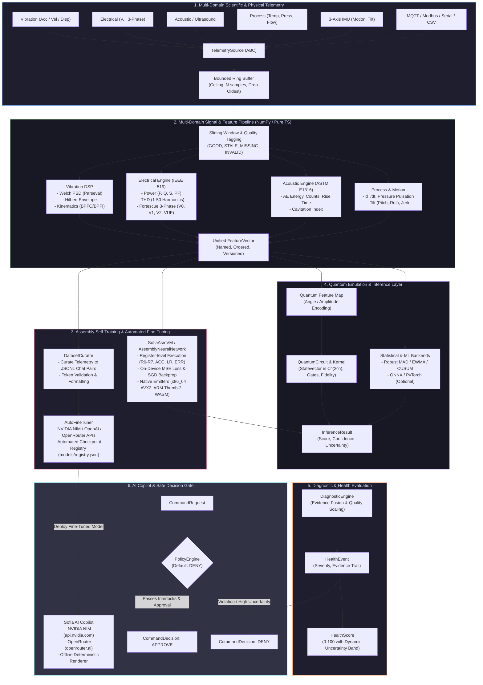

<div align="center">

# SOFIA ENGINE

### General Scientific AI, In-Situ Assembly Neural Self-Training & Multi-Domain Signal Intelligence Runtime

[](LICENSE)
[](pyproject.toml)
[](https://www.npmjs.com/package/@rootcastle/sofia-engine)
[](pyproject.toml)
[](pyproject.toml)
[](docs/AI-Engine-&-Copilot.md)
[](docs/Assembly-Neural-Engine.md)
[](docs/Automatic-Fine-Tuning.md)
[](src/sofia_ai/quantum/)
[](src/sofia_ai/signal/)
[](embedded/)
[](specs/001-sofia-engine-modernization/threat-model.md)
[](https://rootcastle.com/)

[**Documentation**](https://rootcastleco.github.io/sofia-ai/) | [**GitHub Wiki**](https://github.com/rootcastleco/sofia-ai/wiki) | [**NPM Package**](https://www.npmjs.com/package/@rootcastle/sofia-engine) | [**REI SignalLab**](https://github.com/rootcastleco/rei-signallab) | [**Rootcastle**](https://rootcastle.com/)

---

</div>

## Executive Overview

**Sofia Engine** is an engineering-grade, offline-first **General Scientific AI & Edge Intelligence Runtime** developed by **[Rootcastle Engineering & Innovation](https://rootcastle.com/)**. Engineered for demanding scientific research and mission-critical assets—power distribution grids, particle physics instrumentation, high-speed turbomachinery, chemical plants, and autonomous robotics—Sofia provides a unified mathematical foundation that bridges raw physical telemetry, digital signal processing, quantum computing emulation, low-level assembly neural self-training, and automated LLM fine-tuning.

Sofia Engine is far beyond an industrial vibration monitor. Powered by algorithms from **[Rootcastle REI SignalLab](https://github.com/rootcastleco/rei-signallab)** and our high-performance computing labs, it integrates:

1. **General Scientific AI & In-Situ Assembly Neural Self-Training (`sofia_ai.learning.asm`)**:
   - **Register-Based Assembly Virtual Machine (`SofiaAsmVM`)**: 64-bit floating-point registers, fixed memory buffers, and vectorized SIMD instructions (`VEC_DOT`, `VEC_FMA`, `VEC_SUB`, `ACT_RELU`, `UPDATE_SGD`, `COMPUTE_MSE`).
   - **Self-Training Neural Model (`AssemblyNeuralNetwork`)**: Compiles forward inference, loss calculation, backpropagation, and SGD parameter updates directly into virtual bytecode executed on-device without external ML frameworks.
   - **Native Hardware Assembly Emitters**: Emits optimized raw **x86_64 AVX2**, **ARM Cortex-M Thumb-2**, and **WebAssembly (WAT)** code for bare-metal microcontrollers and browser runtimes.
2. **Automated LLM Fine-Tuning Pipeline (`sofia_ai.learning.finetune`)**:
   - **Autonomous Dataset Curation (`DatasetCurator`)**: Curates edge telemetry, diagnostic events, and physical sensor traces into structured JSONL chat pairs with token estimation and validation.
   - **Zero-Dependency Cloud/Edge Tuner (`AutoFineTuner`)**: Automated fine-tuning job submission, tracking, and checkpoint registration with **NVIDIA NIM**, **OpenAI**, and **OpenRouter** endpoints using Python standard library `urllib.request`.
3. **Multi-Domain Industrial & Scientific Signal Processing (`sofia_ai.signal`)**:
   - **Mechanical Vibration**: ISO 10816/20816 severity, Welch PSD (Parseval energy-conserving), Hilbert analytic envelope, rotating machinery kinematics (BPFO, BPFI, BSF, FTF, Gear Mesh).
   - **Electrical Power Quality (IEEE 519 / IEC 61000-4-30)**: Active/Reactive/Apparent Power ($P, Q, S$), Power Factor ($PF$), Total Harmonic Distortion ($\text{THD}_V, \text{THD}_I$ up to 50th harmonic), Fortescue 3-Phase Symmetrical Components ($V_0, V_1, V_2, VUF$), and Sag/Swell/Interruption event detection.
   - **Acoustic Emission & Ultrasound (ASTM E1316)**: High-frequency transient energy, counts, duration, rise time, and cavitation intensity indexing for pumps and valves.
   - **Thermal & Fluid Process Telemetry**: Dynamic rate of change ($dT/dt$), thermal gradient, pressure pulsations, and water hammer transients.
   - **Multi-Axis Inertial Dynamics (IMU)**: 3-axis acceleration vector magnitude ($|\mathbf{a}|$), dynamic tilt (pitch, roll), and dynamic jerk ($d\mathbf{a}/dt$).
4. **Advanced Quantum Computing Emulation (`sofia_ai.quantum`)**:
   - Complex statevector simulation in $\mathbb{C}^{2^n}$ with unitary evolution.
   - Universal gate library: Hadamard ($H$), Pauli ($X, Y, Z$), Phase ($S, T$), Parametric Rotations ($R_x, R_y, R_z$), and Entangling Gates ($CX, CZ$).
   - Quantum Feature Maps (Angle & Amplitude encoding) and Quantum Kernel Estimation ($K(x, y) = |\langle \psi(x) | \psi(y) \rangle|^2$) for quantum-enhanced machine learning.
5. **AI Copilot & Technical Decision Support (`sofia_ai.copilot`)**:
   - Multi-provider AI reasoning engine supporting **NVIDIA NIM** (`api.nvidia.com`), **OpenRouter** (`openrouter.ai`), and deterministic offline fallback.
6. **Deterministic Safety Gate (`PolicyEngine`)**:
   - Strict default **DENY** state machine. Inference and RL models cannot actuate machinery without passing allowlists, operator authorization, interlocks, and Nonce/TTL replay defense.
7. **Universal Multi-Language Runtime**:
   - **Python Core**: Zero runtime dependencies beyond NumPy (`numpy>=1.24`).
   - **TypeScript / Node.js SDK**: Published on npm as [`@rootcastle/sofia-engine`](https://www.npmjs.com/package/@rootcastle/sofia-engine) with zero runtime dependencies.
   - **Embedded C99 Runtime**: Microcontroller engine (`embedded/`) with Q16.16 fixed-point math and Python-verified golden vectors.

---

## The Rootcastle Engineering Pillars

```
+---------------------------------------------------------------------------------------+
|                                ROOTCASTLE PILLARS                                     |
+---------------------------------------------------------------------------------------+
|  1. GENERAL SCIENTIFIC AI      Unifies physics, DSP, quantum emulation, and ML into   |
|                                a rigorous, reproducible scientific framework.         |
|  2. ASSEMBLY-LEVEL AUTONOMY    Self-training neural models running on virtual/native   |
|                                assembly with zero framework overhead.                 |
|  3. AUTOMATED FINE-TUNING      Curates telemetry into JSONL datasets and triggers      |
|                                fine-tuning via NVIDIA NIM and OpenRouter APIs.        |
|  4. MULTI-DOMAIN INTELLIGENCE  Vibration, electrical power, acoustic, thermal, and    |
|                                process signals unified in a single edge runtime.      |
|  5. QUANTUM-INSPIRED SPEED     Statevector emulation, quantum kernels, and VQC.       |
|  6. DEFAULT "DENY" SAFETY      Zero control path bypass. All control decisions pass   |
|                                through physical interlocks and operator gates.        |
|  7. AIR-GAPPED BY DESIGN       Zero network or broker dependency in the core. Runs on |
|                                bare metal, isolated gateways, and microcontrollers.   |
+---------------------------------------------------------------------------------------+
```

---

## System Architecture



---

## Mathematical & Scientific Foundations

### 1. In-Situ Assembly Neural Self-Training
Sofia compiles deep learning forward passes, error gradients, and weight updates directly into virtual register assembly:
* **Forward Pass**:
  $$z_j = \sum_{i} w_{ji} x_i + b_j, \quad h_j = \max(0, z_j)$$
* **MSE Error & Gradient**:
  $$L = \frac{1}{K}\sum_{k=1}^K (\hat{y}_k - y_k)^2, \quad \frac{\partial L}{\partial \hat{y}_k} = \frac{2}{K}(\hat{y}_k - y_k)$$
* **Backpropagation & SGD Update (Instruction: `UPDATE_SGD`)**:
  $$w_{kj}^{(t+1)} = w_{kj}^{(t)} - \eta \cdot \frac{\partial L}{\partial w_{kj}}$$
  Executed in-place on fixed Float64 memory arrays with zero garbage collection pauses.

### 2. Electrical Power Quality & Fortescue Transformation (from REI SignalLab)

* **Instantaneous Active, Reactive, and Apparent Power**:
  $$P = \frac{1}{N}\sum_{n=0}^{N-1} v_n \cdot i_n, \quad S = V_{rms} \cdot I_{rms}, \quad Q = \sqrt{S^2 - P^2}, \quad PF = \frac{P}{S}$$

* **Total Harmonic Distortion ($\text{THD}$)** (IEEE 519 up to 50th harmonic):
  $$\text{THD}_V = \frac{\sqrt{\sum_{h=2}^{50} V_h^2}}{V_1} \times 100\%$$

* **Fortescue Symmetrical Components (3-Phase Unbalance)**:
  Let $a = e^{j \frac{2\pi}{3}} = -\frac{1}{2} + j \frac{\sqrt{3}}{2}$:
  $$\begin{bmatrix} V_0 \\ V_1 \\ V_2 \end{bmatrix} = \frac{1}{3} \begin{bmatrix} 1 & 1 & 1 \\ 1 & a & a^2 \\ 1 & a^2 & a \end{bmatrix} \begin{bmatrix} V_a \\ V_b \\ V_c \end{bmatrix}$$
  * $V_0$: Zero sequence (ground faults).
  * $V_1$: Positive sequence (balanced operating component).
  * $V_2$: Negative sequence (motor overheating / unbalance).
  * **Voltage Unbalance Factor**: $\text{VUF} = \frac{|V_2|}{|V_1|} \times 100\%$.

### 3. Acoustic Emission & Cavitation Indexing (ASTM E1316)

* **Acoustic Emission Energy ($E_{AE}$)**:
  $$E_{AE} = \int_{0}^{T} v(t)^2 \, dt \approx \sum_{n=0}^{N-1} v_n^2 \Delta t$$
* **Cavitation Index ($C_p$)**:
  $$C_p = \frac{\int_{5\text{ kHz}}^{20\text{ kHz}} P(f) \, df}{\int_{0}^{f_s/2} P(f) \, df}$$
  Measures the ratio of broadband high-frequency acoustic collapse energy to overall energy.

### 4. Vibration DSP & Bearing Kinematics

* **Welch Power Spectral Density (Parseval Energy Preserved)**:
  $$\sum_{n=0}^{N-1} |x_n|^2 = \frac{1}{N} \sum_{k=0}^{N-1} |X_k|^2$$
* **Demodulated Analytic Envelope (Hilbert Transform)**:
  $$\tilde{x}(t) = x(t) + j \cdot \mathcal{H}\{x(t)\} = A(t)e^{j\phi(t)}, \quad A(t) = \sqrt{x(t)^2 + [\mathcal{H}\{x(t)\}]^2}$$
* **Bearing Defect Frequencies (Outer/Inner/Ball/Cage)**:
  $$\text{BPFO} = \frac{N_b}{2} f_r \left(1 - \frac{d}{D}\cos\alpha\right), \quad \text{BPFI} = \frac{N_b}{2} f_r \left(1 + \frac{d}{D}\cos\alpha\right)$$

### 5. Advanced Quantum Computing Emulation

* **Quantum Statevector**:
  $$|\psi\rangle = \sum_{i=0}^{2^n-1} \alpha_i |i\rangle \in \mathbb{C}^{2^n}, \quad \sum_{i} |\alpha_i|^2 = 1$$
* **Angle Encoding Feature Map**:
  $$|x\rangle = \bigotimes_{i=1}^n \left(\cos(x_i)|0\rangle + \sin(x_i)|1\rangle\right)$$
* **Quantum Kernel Estimation**:
  $$K(x, y) = |\langle \psi(x) | \psi(y) \rangle|^2$$
  Yields transition fidelity in $[0, 1]$ for quantum support vector machines and anomaly isolation.

---

## Installation

### Python (Core Engine & CLI)
```bash
# Minimal production installation (NumPy only - Zero bloat)
pip install sofia-engine

# With industrial field protocols (MQTT, Modbus, Serial)
pip install "sofia-engine[industrial]"

# Full development suite
pip install "sofia-engine[dev]"
```

### TypeScript / Node.js (Edge & Cloud SDK)
```bash
npm install @rootcastle/sofia-engine
```

---

## Quickstart

### 1. In-Situ Assembly Neural Self-Training (Python & TypeScript)

```python
import numpy as np
from sofia_ai.learning import AssemblyNeuralNetwork

# Initialize assembly neural network (3 inputs -> 8 hidden -> 1 output)
model = AssemblyNeuralNetwork(input_dim=3, hidden_dim=8, output_dim=1, learning_rate=0.05)

# Train directly inside SofiaAsmVM (Forward -> Loss -> Backprop -> SGD in bytecode)
x = np.array([0.8, -0.4, 1.2])
y_target = np.array([2.5])

for epoch in range(100):
    loss = model.train_step(x, y_target)

print(f"Final Assembly Training Loss: {loss:.6f}")
print("Predicted output:", model.forward(x))

# Emit native assembly code for target microcontrollers or WASM
print("x86_64 AVX2 Assembly:\n", model.emit_x86_assembly())
print("WebAssembly (WAT):\n", model.emit_wasm())
```

### 2. Automated Fine-Tuning Pipeline (Python)

```python
from sofia_ai.learning import AutoFineTuner

# Automatically curate telemetry records and trigger fine-tuning
tuner = AutoFineTuner(provider="nvidia") # or "openai", "openrouter"
job = tuner.auto_tune_from_telemetry(
    records=[
        {"device_id": "pump-01", "rms": 4.5, "severity": "WARNING", "recommendation": "Check alignment"},
        {"device_id": "motor-02", "rms": 1.2, "severity": "NORMAL", "recommendation": "Continue monitoring"},
    ],
    dataset_output_path="data/telemetry_ft.jsonl",
    registry_path="models/registry.json"
)
print(f"Fine-Tuning Job ID: {job.job_id} | Status: {job.status}")
```

### 3. Multi-Domain Signal Processing (Python)

```python
import numpy as np
from sofia_ai.features import (
    extract_electrical_features,
    extract_acoustic_features,
    extract_process_features,
    extract_motion_features
)

# 1. Electrical Power Quality (from 230V / 10A 50Hz signals)
t = np.arange(2000) / 2000.0
v = 230.0 * np.sqrt(2) * np.sin(2 * np.pi * 50.0 * t)
i = 10.0 * np.sqrt(2) * np.sin(2 * np.pi * 50.0 * t)
elec_fv = extract_electrical_features(v, i, fs=2000.0)
print(f"Power: {elec_fv['active_power_w']} W | PF: {elec_fv['power_factor']} | THD_V: {elec_fv['thd_v_percent']}%")

# 2. Acoustic Emission & Cavitation
sound = np.sin(2 * np.pi * 12000.0 * t)
ac_fv = extract_acoustic_features(sound, fs=50000.0)
print(f"AE Energy: {ac_fv['energy']:.4f} | Cavitation Index: {ac_fv['cavitation_index']:.2f}")

# 3. 3-Axis IMU Motion & Tilt
ax, ay, az = np.zeros(200), np.zeros(200), np.ones(200)
motion_fv = extract_motion_features(ax, ay, az, fs=100.0)
print(f"Accel Mag: {motion_fv['accel_mag_mean']:.2f} g | Roll: {motion_fv['roll_mean_deg']:.1f}°")
```

### 4. Quantum Circuit & Kernel Estimation (Python)

```python
from sofia_ai.quantum import QuantumCircuit, QuantumKernel

# 1. Create 2-qubit Bell state (|00> + |11>) / sqrt(2)
qc = QuantumCircuit(num_qubits=2)
qc.h(0).cx(0, 1)
print("Measurement counts (1000 shots):", qc.measure(shots=1000))

# 2. Compute Quantum Kernel between two sensor feature vectors
kernel = QuantumKernel(num_qubits=3)
fidelity = kernel.evaluate([0.1, 0.5, 0.9], [0.1, 0.5, 0.9])
print(f"Quantum Kernel Fidelity: {fidelity:.4f}") # 1.0000
```

### 5. AI Copilot (CLI & Python)

```bash
# Ask with auto-detected NVIDIA NIM or OpenRouter key:
sofia ask "Explain voltage unbalance factor (VUF) exceeding 2% in a 3-phase induction motor" --device motor-01
```

```python
from sofia_ai.copilot import AIEngine

ai = AIEngine(provider="auto") # Auto-detects NVIDIA_API_KEY or OPENROUTER_API_KEY
explanation = ai.explain(
    question="Why is THD_I 8.5% critical under IEEE 519?",
    device_id="substation-04",
    evidence=[{"metric": "thd_i", "observed": 8.5, "reference": 5.0}]
)
print(explanation)
```

---

## Specification Traceability

| Requirement Area | Specification IDs | Key Capabilities |
|---|---|---|
| **Scientific AI & Learning** | `SOFIA-LRN-001` - `006` | In-situ Assembly VM, neural self-training, SGD backprop, auto fine-tuning. |
| **Multi-Domain Signals** | `SOFIA-SIG-001` - `012` | Vibration, Electrical (IEEE 519), Acoustic (ASTM E1316), Thermal, Fluid, IMU. |
| **Quantum Emulation** | `SOFIA-QEXP-001` - `005` | Complex statevectors in $\mathbb{C}^{2^n}$, universal gates, quantum kernels. |
| **AI Copilot** | `SOFIA-COP-001` - `004` | NVIDIA NIM & OpenRouter integrations with offline deterministic fallback. |
| **Safety Gate** | `SOFIA-SAFE-001` - `006` | Default DENY, operator approval gate, physical interlocks, Nonce/TTL protection. |
| **Edge Resilience** | `SOFIA-EDGE-001` - `007` | Ring buffers, store-and-forward (64 MiB ceiling), reconnect backoff. |

---

## License & Governance

* **License**: Open-source under **Apache License 2.0**. See [LICENSE](LICENSE) and [NOTICE](NOTICE).
* **Developed by**: **[Rootcastle Engineering & Innovation](https://rootcastle.com/)**.