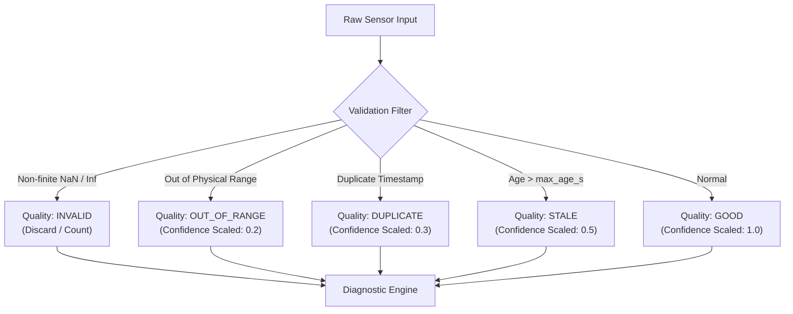

# Condition Monitoring & Machine Health

Sofia Engine transforms raw time-series telemetry into actionable mechanical condition assessments using statistical anomaly detectors, deterministic diagnostic rule matrices, and uncertainty-bounded health scores.

---

## 1. Vibration Severity Framework (ISO 10816 / ISO 20816)

Industrial condition monitoring classifies vibration severity based on machine size, mounting stiffness, and power rating:

| Zone | Severity Status | Operational Guidance |
|---|---|---|
| **Zone A** | Newly Commissioned | Normal, vibration of newly commissioned machines. |
| **Zone B** | Unrestricted Operation | Acceptable for long-term continuous operation without restriction. |
| **Zone C** | Restricted Operation | Unsatisfactory for long-term continuous operation; plan remedial action. |
| **Zone D** | Damage Probable | Vibration severity is sufficient to cause damage to the machine. Trip/Shutdown required. |

Sofia evaluates RMS velocity ($\text{mm/s}$) and RMS acceleration ($g$) against configurable boundary thresholds derived from these standards.

---

## 2. Statistical Anomaly Detectors

Sofia Engine provides a collection of pluggable statistical detectors in `sofia_ai.inference.detectors`:

### 1. Robust Median Absolute Deviation (MAD)
Unlike standard deviation, which is easily distorted by fault transients, MAD provides a 50% breakdown point:

$$\text{MAD} = \text{median}\left(\left|x_i - \text{median}(\mathbf{x})\right|\right)$$

The normalized robust $z$-score is:

$$M_i = \frac{0.6745 \cdot (x_i - \text{median}(\mathbf{x}))}{\text{MAD}}$$

An anomaly is flagged when $|M_i| > \theta$ (typically $\theta = 3.0$ or $3.5$).

### 2. Exponentially Weighted Moving Average (EWMA)
For detecting subtle, progressive drifts in bearing temperature or baseline vibration:

$$Z_t = \lambda x_t + (1 - \lambda) Z_{t-1}, \quad \lambda \in (0, 1]$$

The control limits at time $t$ are:

$$\text{UCL/LCL} = \mu_0 \pm L \sigma \sqrt{\frac{\lambda}{2 - \lambda}\left[1 - (1 - \lambda)^{2t}\right]}$$

### 3. Cumulative Sum Control Chart (CUSUM)
Detects small persistent shifts in mean level:

$$S_t^+ = \max(0, S_{t-1}^+ + x_t - \mu_0 - K)$$
$$S_t^- = \max(0, S_{t-1}^- - x_t + \mu_0 - K)$$

Where $K$ is the reference value (allowable slack) and an alarm triggers if $S_t^+ > H$ or $S_t^- > H$.

### 4. Rolling Z-Score & Interquartile Range (IQR)
* **Z-Score**:
  $$z = \frac{x_t - \mu_w}{\sigma_w}$$
* **IQR**:
  $$\text{IQR} = Q_3 - Q_1, \quad \text{Bounds} = [Q_1 - 1.5 \cdot \text{IQR}, Q_3 + 1.5 \cdot \text{IQR}]$$

---

## 3. Data Quality & Confidence Degradation

Sofia's diagnostic pipeline scales its confidence based on the integrity of the underlying data:

### The Confidence Rule
Sofia Engine enforces **SOFIA-DQ-003**:
$$\text{Confidence}_{final} = \text{Confidence}_{model} \cdot Q_{factor}$$

Where:
* $Q(\text{GOOD}) = 1.0$
* $Q(\text{STALE}) = 0.5$
* $Q(\text{DUPLICATE}) = 0.3$
* $Q(\text{OUT\_OF\_RANGE}) = 0.2$
* $Q(\text{MISSING}) = 0.0$

A degraded data stream **never produces a falsely confident critical diagnosis**.

---

## 4. Holistic Machine Health Scoring

The `compute_health_score()` function maps all active `HealthEvent`s into a single 0–100 index:

$$H = 100 - \min\left(100, \sum_{i=1}^{K} w_i \cdot \mathcal{S}_i \cdot Q_i\right)$$

* $w_i$: Diagnostic rule weight $\in [0, 1]$
* $\mathcal{S}_i$: Event severity penalty:
  - `NORMAL`: $0$
  - `LOW`: $15$
  - `MEDIUM`: $35$
  - `HIGH`: $65$
  - `CRITICAL`: $100$
* $Q_i$: Quality factor of the source telemetry

### Dynamic Uncertainty Bounds
The uncertainty interval $[H_{lower}, H_{upper}]$ is dynamically computed:

$$H_{lower} = \max(0, H - \delta), \quad H_{upper} = \min(100, H + \delta)$$

Where $\delta = \sum_{i=1}^K u_i \cdot \mathcal{S}_i$ aggregates individual event uncertainties $u_i$. If telemetry quality drops or sensor drift is observed, the uncertainty band widens, alerting engineers that diagnostic certainty has diminished.
