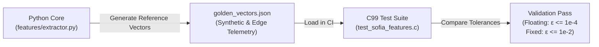

# Embedded C99 & TinyML

Sofia Engine provides a standalone, production-grade **ISO C99 reference implementation** under [`embedded/`](https://github.com/rootcastleco/sofia-rl/tree/main/embedded) for deployment on microcontrollers (MCUs), digital signal processors (DSPs), and resource-constrained edge nodes where a Python runtime is not viable.

---

## 1. Architectural Principles of the C99 Engine

The embedded runtime is engineered to satisfy the strict constraints of embedded systems:

1. **Zero Dynamic Allocation Post-Initialization**:
   - `malloc()` and `free()` are strictly forbidden during streaming execution.
   - All scratchpad buffers and state structures are caller-allocated or statically bound in `sofia_features_init()`.
2. **Fixed Memory Footprint**:
   - Total RAM requirement is predictable at compile time (typically $< 32 \text{ KB}$ for 1024-sample FFT/feature buffers).
3. **MISRA-C & ISO C99 Conformance**:
   - No recursion, no variable-length arrays (VLAs), no unbounded loops, and all pointers are validated before dereferencing.
4. **Platform Independence**:
   - Zero vendor-specific peripheral code. Standard ANSI C99 library (`math.h`, `stdint.h`, `stdbool.h`).

---

## 2. Directory Layout & Key Files

```
embedded/
├── include/
│   ├── sofia_features.h     # Public C API for statistical & spectral extractors
│   └── sofia_fixed.h        # Q16.16 fixed-point arithmetic engine
├── src/
│   ├── sofia_features.c     # Core DSP implementation (RMS, Kurtosis, FFT, Bands)
│   └── sofia_fixed.c        # Fixed-point sqrt, log, and trigonometric primitives
├── tests/
│   └── test_sofia_features.c# Golden-vector test harness
├── Makefile                 # Standalone GCC/Clang build system
└── CMakeLists.txt           # Cross-platform CMake build configuration
```

---

## 3. Fixed-Point Arithmetic (Q16.16)

For microcontrollers lacking a hardware Floating Point Unit (FPU) (such as ARM Cortex-M0+, Cortex-M3, or low-power RISC-V cores), [`sofia_fixed.h`](https://github.com/rootcastleco/sofia-rl/tree/main/embedded/include) provides a full **Q16.16 fixed-point math library**:

* **Representation**: 1 sign bit, 15 integer bits, 16 fractional bits.
* **Resolution**: $\Delta = 2^{-16} \approx 0.00001525878$.
* **Dynamic Range**: $[-32768.0, +32767.99998]$.

### Essential Macros & Operations
```c
#include "sofia_fixed.h"

// Float <-> Fixed conversion
q16_t q_val = SOFIA_F2Q(14.85f);
float f_val = SOFIA_Q2F(q_val);

// Multiplication with 32-bit overflow protection
q16_t prod = sofia_q16_mul(a, b);

// Fixed-point Square Root (Newton-Raphson approximation)
q16_t root = sofia_q16_sqrt(q_val);
```

---

## 4. Golden Vector Verification

To guarantee that features computed on microcontrollers match Python outputs with byte-level precision, Sofia uses a **golden-vector testing strategy**:



### Running the C99 Tests
```bash
cd embedded
make test
```

The test runner asserts that all statistical features (RMS, Peak, Kurtosis, Crest Factor) and spectral band energies agree within strict numerical bounds.

---

## 5. Hardware Target & Porting Guidance

| Deployment Class | Target Platform | Verification Status | Recommended Backend |
|---|---|---|---|
| **Class A: Server / Gateway** | x86_64 / ARM64 Linux, Raspberry Pi 4/5 | **VERIFIED** | Full Python `sofia-engine` + NumPy |
| **Class B: Industrial Edge** | NXP i.MX8, STM32MP1, Yocto RTOS | **PARTIALLY VERIFIED**| Python core or C99 static library |
| **Class C: Microcontroller** | STM32 (Cortex-M4/M7), ESP32, nRF5340 | **NOT VERIFIED in CI** | C99 reference runtime (`embedded/src`) |

> *Note: "NOT VERIFIED in CI" indicates that while the C99 code compiles and passes host unit tests, Rootcastle does not maintain automated hardware-in-the-loop (HIL) testing rigs for every physical silicon vendor in continuous integration.*
