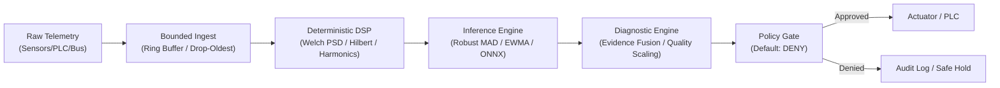

# Welcome to the Sofia Engine Wiki

**Sofia Engine** is an engineering-grade, offline-first edge intelligence runtime developed by **[Rootcastle Engineering & Innovation](https://rootcastle.com/)** for industrial telemetry, condition monitoring, digital signal processing (DSP), and bounded technical automation.

This wiki provides comprehensive mathematical formulations, architectural blueprints, deployment guides, and API contracts for engineers, researchers, and systems architects deploying Sofia Engine on edge gateways, bare metal, or microcontrollers.

---

## The Rootcastle Engineering Pillars

Sofia Engine was engineered from the ground up to replace fragile, stochastic cloud prototypes with deterministic edge infrastructure:

```
+---------------------------------------------------------------------------------------+
|                                ROOTCASTLE PILLARS                                     |
+---------------------------------------------------------------------------------------+
|  1. EVIDENCE BEATS HYPE        Every metric derives from verifiable physical/spectral |
|                                evidence. No unbacked accuracy claims.                 |
|  2. DEFAULT "DENY" SAFETY      Zero control path bypass. All control decisions pass   |
|                                through physical interlocks and operator gates.        |
|  3. BOUNDED RESOURCE ENVELOPE  Strict ceilings on buffers, queues, windows, and disk. |
|                                Zero unbounded memory allocations.                     |
|  4. STRICT DETERMINISM         Pure functions, injected RNGs, and explicit clocks.    |
|                                Same telemetry + same config = byte-identical output.  |
|  5. AIR-GAPPED BY DESIGN       Zero network or broker dependency in the core. Runs on |
|                                bare metal, isolated gateways, and microcontrollers.   |
+---------------------------------------------------------------------------------------+
```

---

## Wiki Navigation & Documentation Map

Explore the detailed engineering manuals:

| Section | Document | Focus Areas |
|---|---|---|
| **Architecture** | [[System-Architecture]] | Ingest buffers, signal pipeline, inference registry, diagnostic engine, edge persistence. |
| **DSP Foundations** | [[Digital-Signal-Processing]] | Welch PSD (Parseval conservation), Hilbert envelope, rotating machinery kinematics (BPFO/BPFI). |
| **Machine Health** | [[Condition-Monitoring-&-Machine-Health]] | ISO 10816/20816 vibration severity, robust MAD/EWMA/CUSUM anomaly detection, data quality, health scoring. |
| **Control Safety** | [[Safety-Gate-&-Policy-Engine]] | Default **DENY** state machine, operator approval, interlocks, Nonce/TTL replay defense. |
| **Embedded & TinyML** | [[Embedded-C99-&-TinyML]] | C99 reference runtime, zero heap allocation post-init, Q16.16 fixed-point math, golden-vector tests. |
| **Field Protocols** | [[Telemetry-Adapters-&-Protocols]] | CSV, JSONL, In-Memory, Replay, MQTT (TLS/QoS), Modbus TCP/RTU, RS-485 Serial adapters. |
| **Operations** | [[CLI-&-Developer-Operations]] | CLI commands (`sofia doctor`, `analyze`, `benchmark`), testing suite, typing & linting workflows. |
| **Security** | [[Security-Policy-&-Threat-Model]] | Threat model covering 21 edge threats, safe deserialization (no pickle), Ed25519 model signing. |

---

## Quick Architecture Summary



---

## Getting Help & Contributing

* **Codebase & Issues**: [GitHub Repository](https://github.com/rootcastleco/sofia-rl)
* **Company & Research**: [Rootcastle Engineering & Innovation](https://rootcastle.com/)
* **Security Advisories**: Report privately per [SECURITY.md](https://github.com/rootcastleco/sofia-rl/blob/main/SECURITY.md)
