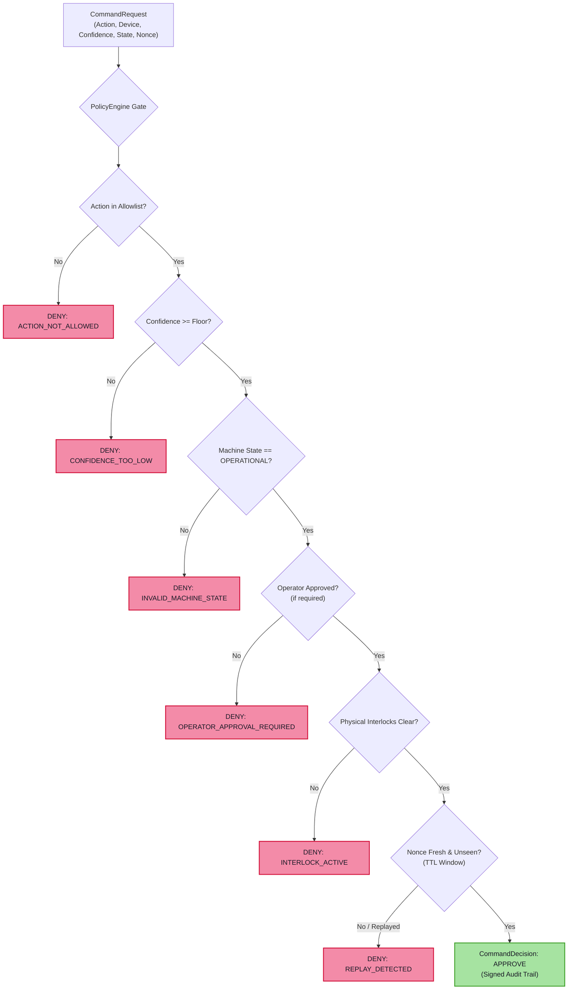

# Safety Gate & Policy Engine

In industrial operational technology (OT), automated actuators and programmable logic controllers (PLCs) govern physical machinery where unconstrained actions can cause catastrophic mechanical failure, severe downtime, or human injury. 

Sofia Engine enforces a strict architectural principle: **No machine learning inference, reinforcement learning agent, or diagnostic copilot can actuate physical equipment directly.** Every actuation intent must pass through the deterministic `PolicyEngine`.

---

## 1. Default "DENY" Architecture

The `PolicyEngine` (`sofia_ai.decision.policy`) implements an uncompromising default **DENY** security posture:



---

## 2. Policy Verification Checks

Every `CommandRequest` must satisfy all of the following criteria simultaneously to receive an `APPROVE` decision:

| Gate | Check | Rationale | Failure Verdict |
|---|---|---|---|
| **1. Allowlist** | `action in allowed_actions` | Prevents arbitrary or unauthorized action strings from entering PLC dispatch. | `ACTION_NOT_ALLOWED` |
| **2. Confidence** | `confidence >= min_confidence` | Ensures decisions are only made when model/detector certainty is high (e.g. $\ge 0.85$). | `CONFIDENCE_TOO_LOW` |
| **3. Machine State** | `state in valid_states` | Prevents actuation if the asset is in `MAINTENANCE`, `FAULT`, or `EMERGENCY_STOP`. | `INVALID_MACHINE_STATE` |
| **4. Operator Gate** | `operator_approved == True` | Mandatory human-in-the-loop authorization for critical commands (e.g., speed changes, shutdowns). | `OPERATOR_APPROVAL_REQUIRED` |
| **5. Interlocks** | `interlocks_clear == True` | Verifies physical limit switches, thermal overloads, and safety trip lines. | `INTERLOCK_ACTIVE` |
| **6. Rate Limiting** | `rate <= max_commands_per_min` | Throttles actuation frequency to prevent valve chatter or contactor wear. | `RATE_LIMIT_EXCEEDED` |
| **7. Replay Window** | `now - timestamp < ttl` and `nonce not seen` | Rejects previously intercepted or delayed network commands. | `REPLAY_DETECTED` / `EXPIRED` |

---

## 3. Code Example: Policy Evaluation

```python
from sofia_ai.decision import PolicyEngine, CommandRequest, MachineState

# Instantiate policy with explicit constraints
policy = PolicyEngine(
    allowed_actions={"THROTTLE_DOWN", "LUBRICATE_BEARING"},
    min_confidence=0.80,
    operator_approval_required=True,
    valid_states={MachineState.OPERATIONAL, MachineState.STANDBY},
)

# 1. Attempt unapproved command -> DENIED
cmd_unapproved = CommandRequest(
    action="THROTTLE_DOWN",
    device_id="turbine-04",
    machine_state=MachineState.OPERATIONAL,
    confidence=0.95,
    operator_approved=False,
)
decision = policy.evaluate(cmd_unapproved)
assert decision.verdict.value == "DENY"
assert decision.reason == "OPERATOR_APPROVAL_REQUIRED"

# 2. Approved command -> APPROVED
cmd_approved = CommandRequest(
    action="THROTTLE_DOWN",
    device_id="turbine-04",
    machine_state=MachineState.OPERATIONAL,
    confidence=0.95,
    operator_approved=True,
)
decision = policy.evaluate(cmd_approved)
assert decision.verdict.value == "APPROVE"
```

---

## 4. Regulatory & Functional Safety Disclaimer

> [!CAUTION]
> **Sofia Engine is an engineering decision-support tool, NOT a certified Safety Instrumented System (SIS).**
>
> Sofia Engine does not claim compliance with:
> * **IEC 61508** (Functional Safety of Electrical/Electronic/Programmable Electronic Safety-related Systems)
> * **ISO 13849** (Safety of Machinery - Safety-related parts of control systems)
> * **IEC 62443** (Security for Industrial Automation and Control Systems)
>
> Physical safety interlocks (emergency stops, mechanical relief valves, hardware trip relays) must remain implemented in dedicated hardware or certified safety PLCs completely outside of Sofia Engine's software control loop.
